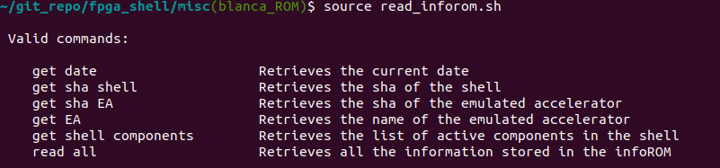
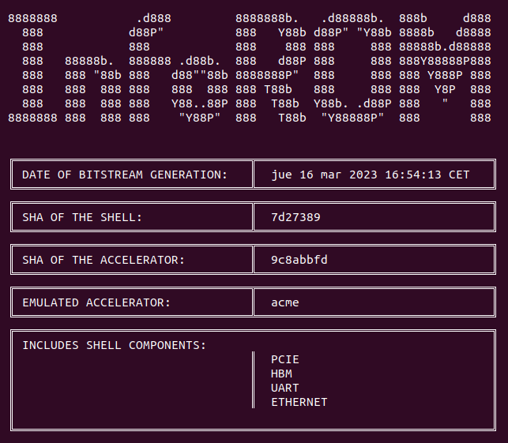

<div align="center">
    "/> 


<br/>
<h1 align="center">MEEP FPGA Shell 
<br/>
<br/>
[project wiki](https://wiki.meep-project.eu/index.php/MEEP_Shell#FPGA_SHELL_TCL_building_program "Wiki")
</div>
<div align="center">


[](https://gitlab.bsc.es/meep/FPGA_implementations/AlveoU280/fpga_shell/-/commits/production)
</div>

## Table of Contents

- [:art: Features](chap2)
  - [:house_with_garden: Supported Emulated Accelerators](#1--🏡-supported-emulated-accelerators-chap1chap1)
  - [📡 Interfaces](chap2.2)
  - [:books: Boards ](chap2.3)
- [:electric_plug: Prerequisites](chap3)
- [🛠️ Usage](chap4)
  - [:crystal_ball: Project creation process](chap4.1)
    - [:racehorse: Quickstart guide](chap4.1.1)
    - [:snail: Dissected guide](chap4.1.2)
  - [:scroll: Acme project features](chap4.2)
  - [:paperclip: Push with GitLab variables](chap4.3)
  - [:inbox_tray: Other available commands](chap4.4)
  - [:mag: Test bitstream](chap4.5)
- [:open_file_folder: Directory Structure](chap5)
- [:pencil2: Bitstreams Naming convention](chap6)
  - [:closed_book: ACME_EA](chap6.1)
- [:earth_africa: Environments](chap7)
  - [:wrench: Production](chap7.1)
  - [:four_leaf_clover: Test](chap7.2)
  - [:dart: Quick Test](chap7.3)
- [:floppy_disk: infoROM information](chap8)
  - [:book: Read infoROM](chap8.1)
    - [:microscope: Read by element](chap8.1.1)
    - [:telescope: Read all at once](chap8.1.2)
- [:woman: Authors](chap9)
- [👷 Partners](chap10)
- [:globe_with_meridians: Wiki](chap11)


## 1- :art: Features `{chap2}`
The shell is meant to be a static perimeter architecture that guarantees that the inside accelerator package can be interchangeable for any other package when meeting a defined I/O interface between the shell and the accelerator package.

### 	1.1- :house_with_garden: Supported Emulated Accelerators `{chap1}`

- acme
- ariane
- dvino
- ea_demo
- epac
- eprocessor
- pronoc
- sargantana


Every EA has a folder  fpga_shell/support with a ea_url.txt file. This file contains the Git URL and the commit SHA. If it is necessary to change the commit SHA to point a specific commit this is the place to modify it.


### 1.2- 📡 Interfaces `{chap2.2}`
The  FPGA Shell implements the following interfaces:

- PCIe: Establishes communication between FPGA and the host server.
- HBM: High Bandwidth Memory. HBM is the high-performance DRAM interface. It is embedded in the same silicon interposer as the Super Logic Regions (SLR).
- Ethernet: 100Gb Ethernet.
- Aurora: P2P interface.
- DDR4: External Memory.
- Info ROM: Stores and reads information on the configuration of the Shell when booting the project
- UART

### 1.3- :books: Boards `{chap2.3}`
The supported boards are as follows:
- Alveo U55C
- Alveo U280

## 2- :electric_plug: Prerequisites `{chap3}`
- The MEEP Shell is compatible with both Vivado 2021.2. and 2021.1 versions
- It only works on Linux. There is no plan to add Windows support in the middle term.

## 3- 🛠️ Usage `{chap4}`
In order to define the interfaces that ought to be active in the Shell, edit <span style="color:green">*accelerator_def.csv*</span> <span style="color:grey"> (`./fpga shell/accelerator/piton/design/chipset/meep shell/accelerator def.csv`)</span> in the following format:
<br/>
```Bash
INTERFACE_NAME,<diasmbiguation>,XXX,XXX,XXX
```
Where *diasmbiguation* is <span style="color:green">**_yes_**</span> in order to activate the component within the Shell, <span style="color:red">**_no_**</span> for it to be absent.<br/>

### 3.1- 		:crystal_ball: Project creation process `{chap4.1}`

#### 3.1.1- 			:racehorse: Quickstart guide `{chap4.1.1}`
If required, adjust the default board. Note that "u55c" is currently set as default.

    make u280

Prior to cloning the accelerator repository, please note that if you wish to specify a particular commit, you must update the ea_url.txt file located in the support folder (`fpga_shell/support`) of the corresponding EA.

    make initialize LOAD_EA=acme

To perform a complete implementation, include any additional parameters. Please refer to Section 4.2 for further information.

    make all LOAD_EA=acme EA_PARAM=acme_ea_4a


#### 3.1.2- 		:snail: Dissected guide `{chap4.1.2}`
After cloning the repository, proceed with the following steps:


----

```Bash
make initialize LOAD_EA=acme  # Should be used with flag LOAD_EA=<selectedEA>
```
Utilize the appropriate initialization flag to incorporate the EA package.
Acme is recommended, but any of the supported EA packages exposed at [Section 1.1](chap1.1) is elligible. 
Also, every EA has a folder `fpga_shell/support` with an ea_url.txt file. This file contains the Git URL and the commit SHA. Modify the commit SHA at this location if you need to specify a particular commit.

----


```Bash
make <board>        # In order to choose the FPGA board, where <board>=u55c / u280. 
```
Where _board_ can be any of those listed in [Section 1.3](chap1.3).

----
```Bash
make project           # Creates the Vivado project. Generates the FPGA shell around the EA 
```
**When working with acme, there are different "flavours" that can be generated**. For additional details, please refer to [Section 3.2](chap4.2).

----
```Bash
make synthesis         # Synthesizes the project
```
```Bash
make implementation    # Implement the project. Creates the synthesis.dcp if it doesn't exist
```
```Bash
make bitstream         # Generates the bitstream. Creates the synthesis.dcp and/or the implementation.dcp if they don't exist
```
For further information, please refer to [this resource](https://wiki.meep-project.eu/index.php/MEEP_Shell#FPGA_MEEP_Shell_use).


### 3.2- 	:scroll: Acme project features `{chap4.2}`
To verify the available flavors for acme, execute the following command:

    make help_ea

If you wish to learn the terminology:

    make syntax_ea

Once you have the name, you can utilize it as follows, referencing the corresponding description in Section 6:


    make project EA_PARAM=acme_ea_4a

If you intend to include flags:

    make project EA_PARAM+="acme_ea_4a meep pronoc hbm"

This will generate an OpenPiton project with Lagarto as a core. Other combinations are available.


### 3.3- 		:paperclip: Push with GitLab variables `{chap4.3}`

    git push -o ci.variable="FPGA_BOARD=u55c" -o ci.variable="CUSTOM_MSG=2x2_withVPU"

    make project EA_PARAMS=pronoc

### 3.4-	:inbox_tray: Other available commands `{chap4.4}`


```Bash
make SmartPlace        # Exahustive search of the best placement strategy (~20hours)
```
```Bash
make reports_synth     # Create synthesis reports: Utilization, timing paths
```
```Bash
make reports_impl      # Create implementation reports: Utilization, timing paths
```

### 3.5-		:mag: Test bitstream `{chap4.5}`
**MEEP SERVERS tools**

You can find the bistream in the folder **bitstream**

Before to load the bistream, you need to setup PATH for drivers:

    PATH=/home/tools/drivers/'hostname'/dma_ip_drivers/QDMA/linux-kernel/bin/:$PATH

you can add it in you local .bashrc.

Then you can use the following command to load the bistream

    /home/tools/fpga-tools/fpga/load-bitstream.sh qdma <your_bistream.bit>

> Be careful with the FPGA board you have used to generate the bistream, and the board you are using to load the bistream. It needs to be the same type.

You can have open in parallel other terminal to use picocom

    picocom: picocom -b 115200 /dev/ttyUSB2

Finally, if you want to boot a binary. You can use the [fpga_tools](https://gitlab.bsc.es/meep/FPGA_implementations/AlveoU280/fpga-tools) to do it.

## 4-	:open_file_folder: Directory Structure `{chap5}`
The MEEP FPGA Shell is built around the **sh**, **shell** and **tcl** folders.

The **sh** folder handle some automatic tasks during the whole flow, working closely with Makefiles.

The **tcl** folder joints most of the Vivado calls, procedures and automated scripts.

The **shell** folder is where all the different IPs that can be part of the Shell (depending on the selected configuration) are stored.

IPs are treated individually, in such a way there is no friction between different set ups, meaning that any combination of IPs can be set with no dependency or incompatibility between them. Which such approach, the Shell can be built incrementaly, adding more pieces as they are needed. The only exception to this are the shell_mmcm.tcl file, which configures the clock infrastructure for the
whole design, and the shell_qdma.tcl. The call to these tcls is mandatory, as it will be explained later.

## 5-	:pencil2: Bitstreams Naming convention `{chap6}`

To ensure a standardized approach for generating bitstream name releases, it is essential to adhere to certain mandatory rules, which include:

### 5.1- :closed_book: ACME_EA `{chap6.1}`

All the bistreams will use the **ACME_EA** with three letters to better identify the main characteristics:

- First letter: to designate the core (A: _Ariane_; H: _Lagarto Hun_)
- Second letter: to identify the accelerator (x: _no accelerator_; V: _VPU_; G: _VPU+SA-HEVC+SA-NN_)
- Thrid letter: to identify the Memory Tile (x: _no MT_, M: _Memory Tile_)

To complete this information, we will add an extra value to each fields:

- **acme_ea_ahbvcm**; where:
  - "a" means the number of cores in the system
  - "b" means the number of vector lanes
  - "c" means the number of MT

## 6- 	:earth_africa: Environments `{chap7}`

We have defined two different environments in order to generate different bitstreams. Those are **Production** and **Test** .

### 6.1- 	:wrench: Production `{chap7.1}`

The production environment will be a monthly release. We will work with:

All use **ProNoC** routers

| Bitstream names                                                  | Description                  | Status                                       |
| :--------------------------------------------------------------- | :--------------------------- | :------------------------------------------- |
| acme_ea_4a                                                       | _golden reference_           | available                                    |
| acme_ea_1h16g1m                                                  |                              | **not** available yet. Pending from MT & SAs |
| acme_ea_4h2v4m                                                   |                              | **not** available yet . Pending from MT      |
| acme_ea_4h2v2m                                                   | (L1.Ariane)                  | **not** available yet [pending from MT]      |
| Meanwhile 2, 3 & 4 are in place we will include a transition one |
| acme_ea_1h16v                                                    | (L1.Ariane)                  | available                                    |
| acme_ea_4h2v                                                     | (L1.Ariane)                  | available                                    |
| acme_ea_1h                                                       | (L1.Ariane) Drivers purposes | available                                    |

:books: The FPGA card used here is the **u55c** (default).

There are two ways to execute the pipeline using this environment. By Merge request event :arrow_heading_up: and schedule (monthly, the 1th):clock1:.

The bitstreams generated will be released in [here](https://release.meep-project.eu/nexus/#browse/search/raw).

### 6.2- :four_leaf_clover: Test `{chap7.2}`

The same ones than before with **OP routers**. This will help to ensure nothing is broken on the way .

Including a bitstream with Lagarto Tile: ACME_EA 1Hxx v2.y.z (L1.Tile) with OP routers and ProNoC routers. (Pending)

:card_box: Here we uses the **u280** and **u55c** fpga cards.

If we want to use this environment, we need to use in our _commit message_ **#TestCICD**

### 6.3- :dart: Quick Test `{chap7.3}`

The same ones than before with **OP routers**. This will help to ensure nothing is broken on the way .I

:card_box: Here we uses the **u55c** fpga card.

If we want to use this environment, we need to use the gitlab web page -> **Run Pipeline**

There you can add the **EA** variable the right bitstream configuration do you want to use.


## 7- :floppy_disk: infoROM information `{chap8}`
The ROM hardcoded in the FPGA Shell (infoROM), stores the following information:
- Date of the project generation
- SHA of the Shell
- SHA of the Accelerator
- IDs of the active interfaces

The active interfaces are defined in [accelerator_def](https://wiki.meep-project.eu/index.php/MEEP_Shell#FPGA_SHELL_TCL_building_program "accelerator_def.csv") and parsed in 
[define_shell.sh](https://gitlab.bsc.es/meep/FPGA_implementations/AlveoU280/fpga_shell/-/blob/blanca_ROM/sh/define_shell.sh "define_shell.sh "), where all the aforementioned information gets written in a new file initrom.mem (gets rewritten if it already exists), stored in _misc_ directory inside the parent directory _fpga_shell_. When issuing _make project_, the [Makefile](https://gitlab.bsc.es/meep/FPGA_implementations/AlveoU280/fpga_shell/-/blob/blanca_ROM/Makefile "Makefile")  moves the information stored in _initrom.mem_ into the ip.

### 7.1-		:book: Read infoROM `{chap8.1}`
In order to read from the infoROM, execute [read_inforom.sh](https://gitlab.bsc.es/meep/FPGA_implementations/AlveoU280/fpga_shell/-/blob/blanca_ROM/misc/read_inforom.sh):
```Bash
source read_inforom.sh
```

<div align="center">
    "/> 

Output of *source read_inforom.sh* 
</div>

#### 7.1.1-:microscope: Read by element `{chap8.1.1}`
```Bash
get date
```
```Bash
get sha shell
```
```Bash
get sha EA
```
```Bash
get EA
```
```Bash
get shell components
```
#### 7.1.2- :telescope: Read all at once `{chap8.1.2}`
```Bash
read all
```
This will automatically kill the process.
<div align="center">
    "/> 

Output of *read all* command
</div>


[Futher information](https://wiki.meep-project.eu/index.php/MEEP_InfoROM)


## 8- :woman: Authors `{chap9}`
- Alex Kropotov: alex.kropotov@bsc.es
- Bachir Fradj: bachir.fradj@bsc.es
- Blanca Sabater: bsabater@bsc.es
- Daniel J. Mazure: daniel.jimenez2@bsc.es
- Elias Perdomo: elias.perdomo@bsc.es
- Francelly Cano Ladino: francelly.canoladino@bsc.es


## 9- 👷 Partners `{chap10}`
**Barcelona Supercomputing Center** - Centro Nacional de Supercomputación (BSC-CNS) :globe_with_meridians:
[Website](https://www.bsc.es "Welcome")
<br/>**University of Zagreb**, Faculty of Electrical Engineering and Computing
:globe_with_meridians: [Website](https://www.fer.unizg.hr/en "Welcome")
<br/>**TÜBITAK BILGEM** Informatics and Information Security Research Center :globe_with_meridians: [Website](https://bilgem.tubitak.gov.tr/en "Welcome")


## 10- :globe_with_meridians: Wiki `{chap11}`

For more detailed instructions on how to use this software, visit [project wiki](https://wiki.meep-project.eu/index.php/MEEP_Shell#FPGA_SHELL_TCL_building_program "Wiki").

<br/>
<br/>
<div align="center">
<h2 align="center">🤝 Support</h2>
<p align="center">The MEEP project has received funding from the European High-Performance Computing Joint Undertaking (JU) under grant agreement No 946002. The JU receives support from the European Union’s Horizon 2020 research and innovation programme in Spain, Croatia, Turkey.</p>
