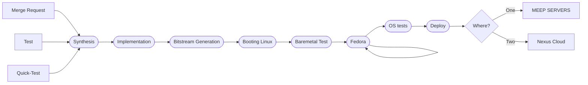

# FPGA Shell

[](https://gitlab.bsc.es/hwdesign/fpga/integration-lab/fpga-shell/commits/production)

</div>

## Publication

Makinote has been published in ACM RAPIDO '2024: Elias Perdomo, Alexander Kropotov, Francelly Katherine Cano Ladino, Syed Zafar, Teresa Cervero, Xavier Martorell Bofill, and Behzad Salami. "Makinote: An FPGA-Based HW/SW Platform for Pre-Silicon Emulation of RISC-V Designs". In Proceedings of the 16th Workshop on Rapid Simulation and Performance Evaluation for Design (RAPIDO '24). Association for Computing Machinery, New York, NY, USA, 29–34. January 2024. https://doi.org/10.1145/3642921.3642928

If you use our Makinote HW or SW tools anyhow in your research please reference our AMC paper mentioned above and send us a citation of your work.


## Table of Contents

[[_TOC_]]

## 1- :art: Features

The shell is meant to be a static perimeter architecture that guarantees that the inside accelerator package can be interchangeable for any other package when meeting a defined I/O interface between the shell and the accelerator package.


### 1.1- 📡 Interfaces

The FPGA Shell implements the following interfaces:

- PCIe: Establishes communication between FPGA and the host server.
- HBM: High Bandwidth Memory. HBM is the high-performance DRAM interface. It is embedded in the same silicon interposer as the Super Logic Regions (SLR).
- Ethernet: 100Gb Ethernet.
- Aurora: P2P interface.
- DDR4: External Memory.
- Info ROM: Stores and reads information on the configuration of the Shell when booting the project
- UART

### 1.2- :books: Boards

The supported boards are as follows:

- Alveo U55C
- Alveo U280

## 2- :electric_plug: Prerequisites

- The FPGA Shell is compatible with both Vivado 2021.2. and 2021.1 versions
- It only works on Linux. There is no plan to add Windows support in the middle term.

## 3- 🛠️ Usage

In order to define the interfaces that ought to be active in the Shell, edit <span style="color:green">_accelerator_def.csv_</span> <span style="color:grey"> (`./fpga shell/accelerator/piton/design/chipset/meep shell/accelerator def.csv`)</span> in the following format:
<br/>

```Bash
INTERFACE_NAME,<diasmbiguation>,XXX,XXX,XXX
```

Where _diasmbiguation_ is <span style="color:green">**_yes_**</span> in order to activate the component within the Shell, <span style="color:red">**_no_**</span> for it to be absent.<br/>

### 3.1- :house_with_garden: Supported Emulated Accelerators (EA)[^1]

Most of these accelerators are been used in BSC and some of them are not open source at the moment.

| EA             |                                                                                                                                                                                                                                                                     Description                                                                                                                                                                                                                                                                     |                                                         Status |
| :------------- | :-------------------------------------------------------------------------------------------------------------------------------------------------------------------------------------------------------------------------------------------------------------------------------------------------------------------------------------------------------------------------------------------------------------------------------------------------------------------------------------------------------------------------------------------------: | -------------------------------------------------------------: |
| **acme**       |                                                                                                                                                                                                                                MEEP accelerator. The bistreams will be the only public resource available for anyone                                                                                                                                                                                                                                |                                                        Updated |
| **ariane**     |                                                                                                                                                                                                                                         Ariane RISC-V CPU from. It has been tested from meep_openpiton repo                                                                                                                                                                                                                                         |                                                        Updated |
| **dvino**      | Dvino ASIC top is the RTL module which contains the peripherals, the Scalar core Lagarto Hun with a VPU coprocessor and the cache memory hierarchy from LowRisc. Lagarto Hun is a scalar pipeline with 5 stages in order that supports RV64IMA ISA 2.1 and privileged ISA 1.11. Lagarto Hun integrates a Hydra 2-lane VPU has 4064-bit vector length and supports the RISC-V vector extension 0.7.1. The L1 data cache and L2 caches are from LowRisc. It uses the Untethered LowRisc version 0.2. The L1 Instruction Cache is In-House as the CSR. |   Depracated,it needs to include the BROM memory inside the EA |
| **ea_demo**    |                                                                                                                                                                                                                                        A dummy placeholder for the development of new emulated accelerators                                                                                                                                                                                                                                         |                                                        Updated |
| **eprocessor** |                                                                                                                                                                                           It is currently compliant with FPGA shell latest updates. It was tested with the Bare-metal "Hello_eProcessor". Is necessary to check the Linux Boot process -                                                                                                                                                                                            |                                                        Updated |
| **sargantana** |                                                                                                                                                                                                                                                               DRAC Lagarto Processor                                                                                                                                                                                                                                                                |                                                              - |
| **ea_ait**     |                                                                                                                                                                                                                     Interfaces the Shell with AIT which is a tool to generate accelerators from C or C++ code usin OmpSs@FPGA.                                                                                                                                                                                                                      |                           Finishing the AIT + Shell Interfaces |
| **ea_sandbox** |                                                                                                                                                                                                 Interfaces the Shell with the Sandbox tool which generates configurable designs to explore HBM and DDR performance based on throughput and Latency.                                                                                                                                                                                                 | Sandbox tool completed and doing the interface with the Shell. |

Every EA has a folder fpga_shell/support with a ea_url.txt file. This file contains the Git URL and the commit SHA. If it is necessary to change the commit SHA to point a specific commit this is the place to modify it.

[^1]: (EA): This element is where all the data process is executed, and involves computation and memory management. In the future, the architecture of the accelerator will depend on Third Parties, since they will be able to map, place and route their own designs. But, right now as a PoC, MEEP considers a specific accelerator architecture, conformed by a set of IPs RISC-V compliant.

### 3.2- :crystal_ball: Project creation process

#### 3.2.1- :racehorse: Quickstart guide

If required, adjust the default board. Note that "u55c" is currently set as default.

    make u55c

Prior to cloning the accelerator repository, please note that if you wish to specify a particular commit, you must update the ea_url.txt file located in the support folder (`fpga_shell/support`) of the corresponding EA.

    make initialize LOAD_EA=sargantana

#### 3.2.2- :snail: Dissected guide

After cloning the repository, proceed with the following steps:

---

```Bash
make initialize LOAD_EA=acme  # Should be used with flag LOAD_EA=<selectedEA>
```

Utilize the appropriate initialization flag to incorporate the EA package.
Acme is recommended, but any of the supported EA packages exposed at [Section 1.1](#11--house_with_garden-supported-emulated-accelerators) is elligible.
Also, every EA has a folder `fpga_shell/support` with an ea_url.txt file. This file contains the Git URL and the commit SHA. Modify the commit SHA at this location if you need to specify a particular commit.

---

```Bash
make <board>        # In order to choose the FPGA board, where <board>=u55c / u280.
```

Where _board_ can be any of those listed in [Section 1.3](Boards).

---

```Bash
make project           # Creates the Vivado project. Generates the FPGA shell around the EA
```

**When working with acme, there are different "flavours" that can be generated**. For additional details, please refer to [Section 3.2](Acme project features).

---

```Bash
make synthesis         # Synthesizes the project
```

```Bash
make implementation    # Implement the project. Creates the synthesis.dcp if it doesn't exist
```

```Bash
make bitstream         # Generates the bitstream. Creates the synthesis.dcp and/or the implementation.dcp if they don't exist
```

For further information, please refer to [this resource](https://wiki.meep-project.eu/index.php/MEEP_Shell#FPGA_MEEP_Shell_use).

### 3.3- :scroll: Acme project features

To verify the available flavors for acme, execute the following command:

    make help_ea

If you wish to learn the terminology:

    make syntax_ea

Once you have the name, you can utilize it as follows, referencing the corresponding description in Section 6:

    make project EA_PARAM=acme_ea_4a

If you intend to include flags:

    make project EA_PARAM+="acme_ea_4a meep pronoc hbm"

This will generate an OpenPiton project with Lagarto as a core. Other combinations are available.

### 3.4- :paperclip: Push with GitLab variables

    git push -o ci.variable="FPGA_BOARD=u55c" -o ci.variable="CUSTOM_MSG=2x2_withVPU"

    make project EA_PARAMS=pronoc

### 3.5- :inbox_tray: Other available commands

```Bash
make SmartPlace        # Exahustive search of the best placement strategy (~20hours)
```

```Bash
make reports_synth     # Create synthesis reports: Utilization, timing paths
```

```Bash
make reports_impl      # Create implementation reports: Utilization, timing paths
```

### 3.6- :mag: Test bitstream

**MEEP SERVERS tools**

You can find the bistream in the folder **bitstream**

**DRIVERS**

1. Default drivers in HW Servers:

Before to load the bistream, you need to setup PATH for drivers:

    PATH=/home/tools/drivers/'hostname'/dma_ip_drivers/QDMA/linux-kernel/bin/:$PATH

you can add it in you local .bashrc.

Then you can use the following command to load the bistream

    /home/tools/fpga-tools/fpga/load-bitstream.sh qdma <your_bistream.bit>

2. ONIC drivers

The actual CI is using the onic drivers. Please follow the instruction in the [readme](https://gitlab.bsc.es/meep/FPGA_implementations/AlveoU280/fpga-tools/-/blob/main/README.md) file.

> Be careful with the FPGA board you have used to generate the bistream, and the board you are using to load the bistream. It needs to be the same type.

You can have open in parallel other terminal to use picocom

    picocom: picocom -b 115200 /dev/ttyUSB2

Finally, if you want to boot a binary or test the UART output log, you can use the [fpga_tools](https://gitlab.bsc.es/meep/FPGA_implementations/AlveoU280/fpga-tools) to do it. Follow the README instructions.

## 4- :open_file_folder: Directory Structure

The FPGA Shell is built around the **sh**, **shell** and **tcl** folders.

The **sh** folder handle some automatic tasks during the whole flow, working closely with Makefiles.

The **tcl** folder joints most of the Vivado calls, procedures and automated scripts.

The **shell** folder is where all the different IPs that can be part of the Shell (depending on the selected configuration) are stored.

IPs are treated individually, in such a way there is no friction between different set ups, meaning that any combination of IPs can be set with no dependency or incompatibility between them. Which such approach, the Shell can be built incrementaly, adding more pieces as they are needed. The only exception to this are the shell_mmcm.tcl file, which configures the clock infrastructure for the
whole design, and the shell_qdma.tcl. The call to these tcls is mandatory, as it will be explained later.

## 5- :earth_africa: Environments. CICD

We have defined three different environments in order to generate different bitstreams. Those are **Production**, **Test**, and **Quick-test**.



### 6.1- :wrench: Production.


The production environment will be a monthly release. We will work with:

:books: The FPGA card used here are the **u280** and **u55c** (default).

There are two ways to execute the pipeline using this environment. By Merge request event :arrow_heading_up: and schedule (monthly, the 1th):clock1:.

The bitstreams generated will be released in [here](https://release.meep-project.eu/nexus/#browse/search/raw).

### 6.2- :four_leaf_clover: Test

:card_box: Here we use the **u280** and **u55c** fpga cards.

If we want to use this environment, we need to use in our _commit message_ **#TestCICD**

### 6.3- :dart: Quick Test

The same ones than before with **OP routers**. This will help to ensure nothing is broken on the way .I

:card_box: Here we use the **u55c** fpga card.

If we want to use this environment, we must use the GitLab web page. CICD -> **Run Pipeline** -> **Choose** the _branch_ and set _variable_ **EA** with a specific value. You can use `make help_ea` to know the available bitstream configurations.

There you can add the **EA** variable the right bitstream configuration do you want to use.

## 7- :floppy_disk: infoROM information

The ROM hardcoded in the FPGA Shell (infoROM), stores the following information:

- Date of the project generation
- SHA of the Shell
- SHA of the Accelerator
- IDs of the active interfaces

The active interfaces are defined in [accelerator_def](https://wiki.meep-project.eu/index.php/MEEP_Shell#FPGA_SHELL_TCL_building_program "accelerator_def.csv") and parsed in
[define_shell.sh](https://gitlab.bsc.es/meep/FPGA_implementations/AlveoU280/fpga_shell/-/blob/blanca_ROM/sh/define_shell.sh "define_shell.sh "), where all the aforementioned information gets written in a new file initrom.mem (gets rewritten if it already exists), stored in _misc_ directory inside the parent directory _fpga_shell_. When issuing _make project_, the [Makefile](https://gitlab.bsc.es/meep/FPGA_implementations/AlveoU280/fpga_shell/-/blob/blanca_ROM/Makefile "Makefile") moves the information stored in _initrom.mem_ into the ip.

### 7.1- :book: Read infoROM

In order to read from the infoROM, execute [read_inforom.sh](https://gitlab.bsc.es/meep/FPGA_implementations/AlveoU280/fpga_shell/-/blob/blanca_ROM/misc/read_inforom.sh):

```Bash
source read_inforom.sh
```

#### 7.1.1-:microscope: Read by element

```Bash
get date
```

```Bash
get sha shell
```

```Bash
get sha EA
```

```Bash
get EA
```

```Bash
get shell components
```

#### 7.1.2- :telescope: Read all at once

```Bash
read all
```

This will automatically kill the process.


## 8- :woman: Authors

fpga@bsc.es


## 9- :globe_with_meridians: Wiki

For more detailed instructions on how to use this software, visit [project wiki](https://wiki.meep-project.eu/index.php/MEEP_Shell#FPGA_SHELL_TCL_building_program "Wiki").

## 11-:grey_question: FAQ

#### 11.1- Creating the project, I found this error:

    [MEEP] ERROR: File project_options.tcl has not been loaded
    [MEEP] ERROR: couldn't read file "~/fpga_shell/accelerator/piton/design/chipset/meep_shell/tcl/openpiton_conf.tcl": no such file or directory

Answer

> We need to check this log cat meep_openpiton/build/alveou280/system/protosyn_logs7make_project.log

> We are using Python3. Please check the Python version you are using https://github.com/MEEPproject/meep_ariane/blob/f62b738515f0ea2126d9ee0deed387324978f346/openpiton/bootrom/linux/Makefile#L49

#### 11.2- Generating the bitstream, I found this error:

    ERROR: [Common 17-69] Command failed: This design contains one or more cells for which bitstream generation is not permitted:
    meep_shell_inst/Eth100GbSyst_w_hbm/inst/eth100gb/inst/i_Eth_CMAC_syst_eth100gb_0_top

Answer

> You need to get the license here:
> https://www.xilinx.com/products/intellectual-property/cmac_usplus.html#overview


